# Introduction to plotting in R

Joseph Hughes, MRC-University of Glasgow Centre for Virus Research

R is a great additional language to learn as it has many statistical packages and lots of packages for plotting data. In this practical, you will learn to do basic plots using *ggplot2* with a data set from the COG-UK consortium with the number of SARS-CoV2 sequences from different countries up to the 9th December 2020.

**Note** Normally I work using Rstudio on my local mac and the plan was to do the same on the windows computor this practical, we will be working using Rstudio locally on your windows computers, however, I've struggled to get I.T. to install the packages on the visitor accounts. Therefore, we will be working on the server in R and downloading using MobaXterm the figures that we produce. 

1. First login to alpha2 using your credentials.
2. Create a new directory for everything we will do in this practical. Let's call it `Rplots`
3. Change directory into `Rplots`
4. Copy the data file into `cp /home4/VBG_data/Rplotting/cog_global_2020-12-09_public.csv .`


Now it is time to launch R on the server, we do this by simply typing `R`


The following command will install a package that makes it easy to customize ggplots with no advanced programming skills.

``` r
require(ggplot2)
```

If that didn't work, then you first need to install the package and then run the command.

``` r
install.packages("ggpubr")
require(ggpubr)
```

### 1. Data import

If your working directory is the same as the folder containing the **cog_global_2020-12-09_public.csv**, you can read the file as described below. Use `getwd()` to check your working directory and `setwd()` to set a working directory (likely, **setwd("\~/Rplots")**).

``` r
cog_data = read.csv( file = "cog_global_2020-12-09_public.csv", header = TRUE )

cog_data
```

You can also import the data manually. However, in most cases, we use functions to bring data into the R environment.

Example of manually adding data to a variable:

``` r
# data source - https://en.wikipedia.org/wiki/United_Kingdom

UK_pop_2022<- 67596281 
```

### 2. Barplot

Let’s start with barplot to illustrate the numbers of seuences by country. First we need to do a bit of data manipulation to get the number of sequences by country and filtering out some of the countries that have less than 100 sequences. The package `tidyverse` is great for this.

``` r
install.packages("tidyverse")
require(tidyverse)
per_country_count<-cog_data %>% count(country) %>% filter(n > 100)
```

Now we can plot those counts

``` r
ggplot() +
  geom_bar( data = per_country_count, aes( x = country, y = n ), stat="identity" )
```

The following image should open in an X-window. 


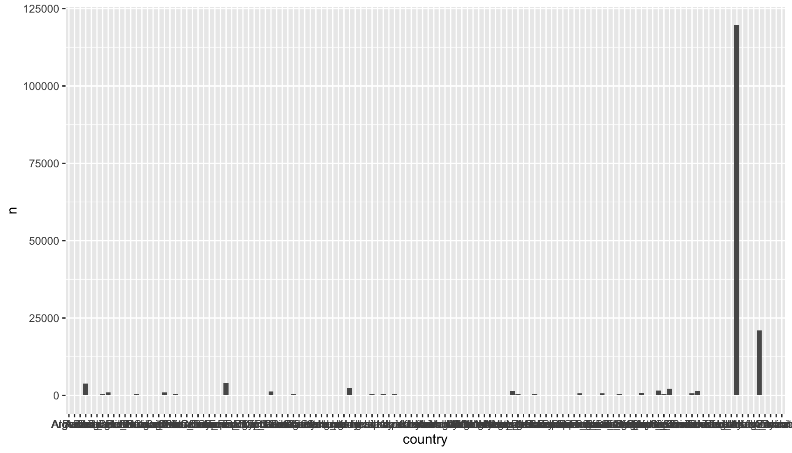


It is also possible to save the image with the following command

``` r
ggsave("seq_per_country.pdf")
```

Then, using mobaXterm, you can download the image to your local computer.

We can see the names of those countries mingling together. There are several ways to fix the issue; for example, set the axis text to smaller size. What we will do is to flip the axis by simply setting `x` as number of sequences (n) and `y` as the country.

``` r
ggplot() +
  geom_bar( data = per_country_count, aes( x = n, y = country ), stat="identity" )
```

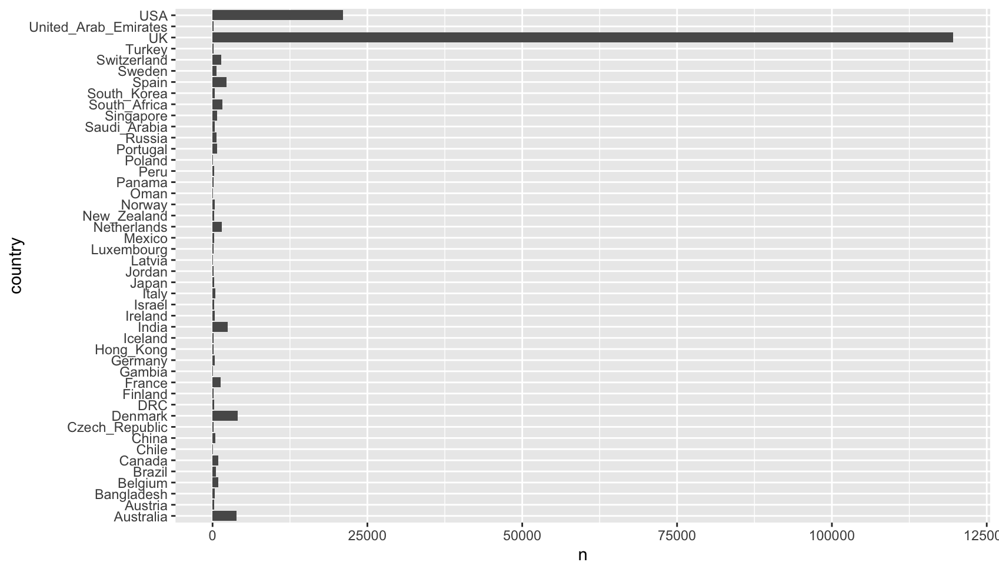

*ggplot2* automatically plots following an alphabetical order. To order (and to present a descending/increasing) pattern, we can specify this when we plot with **fct_reorder**.

``` r
ggplot() +
  geom_bar( data = per_country_count, aes( x = n, y = fct_reorder(country, n) ), stat="identity" )
```

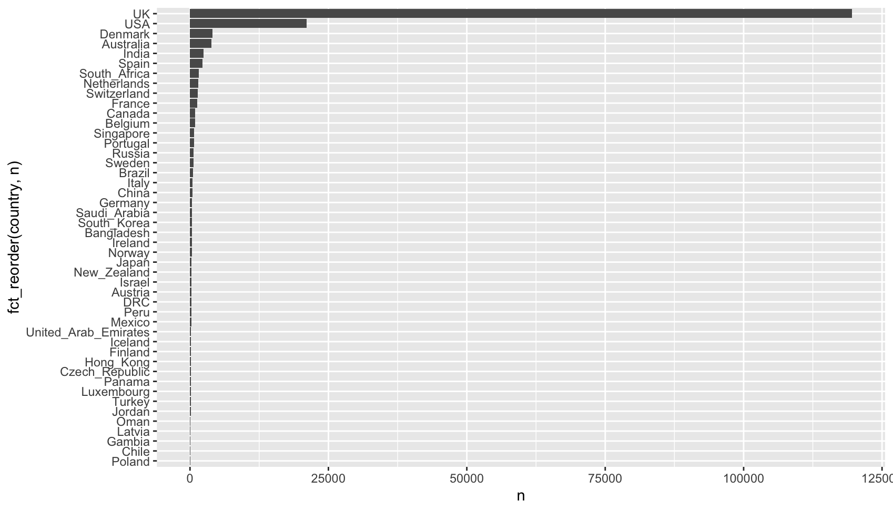

Add some color to the bars and change the axis labels

``` r
ggplot() +
  geom_bar( data = per_country_count, aes( x = n, y = fct_reorder(country, n)), stat="identity" , fill = "orange", color = "purple") + 
  xlab("Number of sequences")+
  ylab("Country")
```

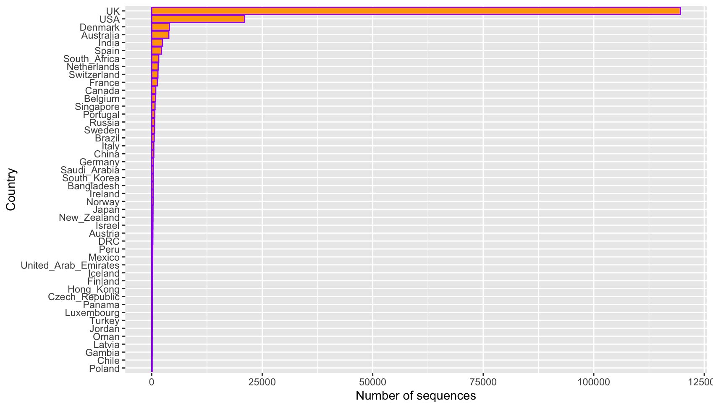

### 3. Scatter plot

Next we are interested in seeing whether the greater number of sequences in a country result in a larger number of lineages being observed. To do this we need to do some more aggregation of data from our original file.

``` r
lineages_per_country<-cog_data %>% group_by(country) %>% summarize(distinct_lineage = n_distinct(lineage), nb_sequences=n())
```

Now we can plot the results from this summarised dataset.

``` r
ggplot() +
  geom_point( data = lineages_per_country, aes( x = nb_sequences, y = distinct_lineage ) ) 
```

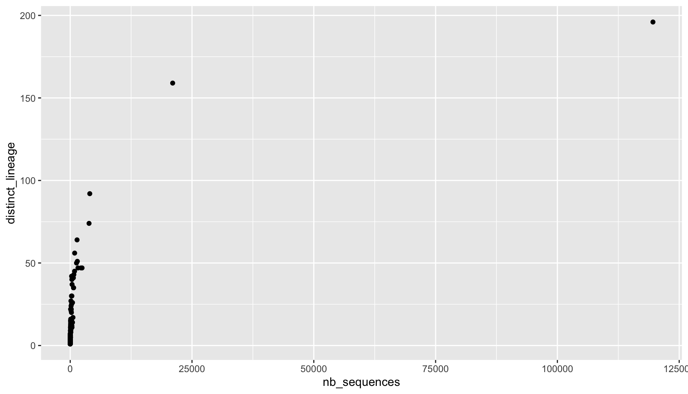

We can add the country names next to the points by adding a `geom_text` layer.

``` r
# Labeling the points by 'geom_text'

ggplot() +
  geom_point( data = lineages_per_country, aes( x = nb_sequences, y = distinct_lineage ) ) +
  geom_text( data = lineages_per_country, aes( x = nb_sequences, y = distinct_lineage, label = country ) )
```

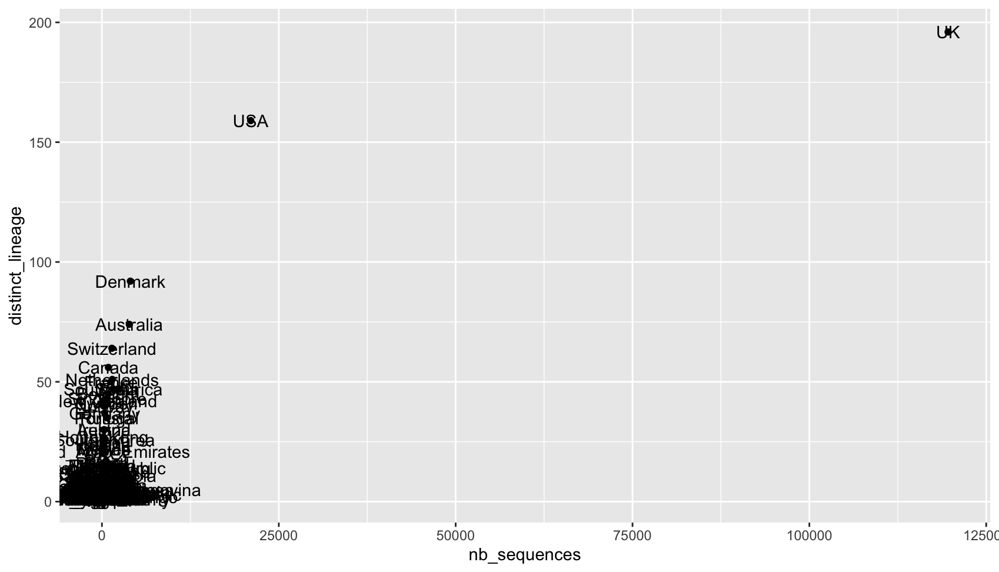

#### 3.3 Size and opacity

The size and opacity of points can also be changed on the figure. We can adjust the points according to the relative number of sequences. The circles that indicate the cities in National Capital Region are overlapped. To make them more distinguishable, we lower the opacity of all the circles by using `alpha`. In addition, we remove the background by adopting one of the default themes provided by *ggplot2*. Full list of themes is available here: <https://ggplot2.tidyverse.org/reference/ggtheme.html>.

``` r
# ggplot2 theme `theme_minimal`

ggplot() +
  geom_point( data = lineages_per_country, aes( x = nb_sequences, y = distinct_lineage, size = nb_sequences ), alpha = 0.3 ) + 
  theme_minimal() +
  xlab("Number of sequences") + 
  ylab("Number of distinct lineages") + 
  guides(size=guide_legend(title="Number of sequences"))
```

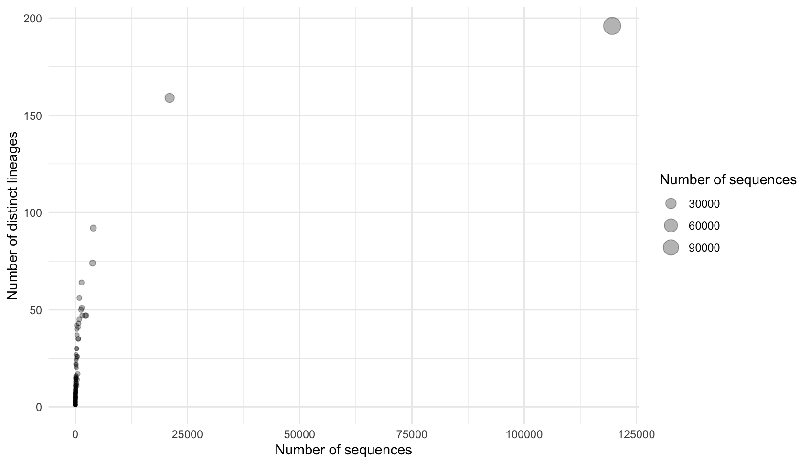

#### 3.4 Combining multiple figures

Currently, we can't see much of what is happening in the countries that have small numbers of sequences. We can generate another figure with a closer view and then combine the two figures as separate panels into one figure. The zoom-in panel will be generated with different coordinates on both axes.

``` r
# Cropping the larger figure by setting the 'limits' in x and y scales 
ggplot() +
  geom_point( data = lineages_per_country, aes( x = nb_sequences, y = distinct_lineage, size = nb_sequences ), alpha = 0.3 ) + 
  scale_x_continuous(limits = c(0,1000)) +
  scale_y_continuous(limits = c(0,75))  +
  theme_minimal() +
  xlab("Number of sequences") + 
  ylab("Number of distinct lineages") + 
  guides(size=guide_legend(title="Number of sequences"))
```

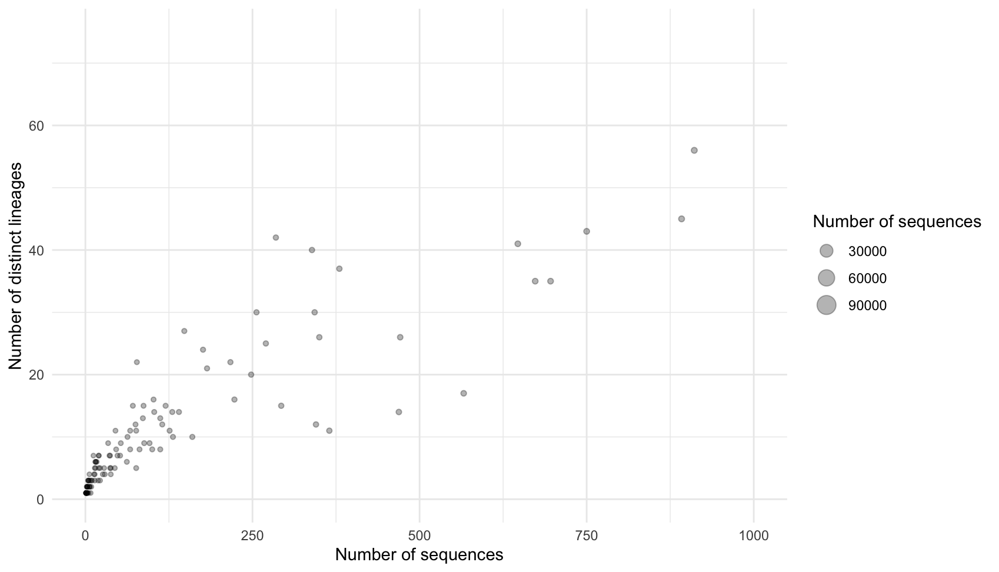

We then assign the two figures as ggplot objects with different names (variable names). Thanks to the package `ggpubr`, the function `ggarrange` combines multiple figures as one easily. Arguments in `ggarrange`, for example, `labels`, `align`, are useful in scientific papers.

``` r
f_large <- 
ggplot() +
  geom_point( data = lineages_per_country, aes( x = nb_sequences, y = distinct_lineage, size = nb_sequences ), alpha = 0.3 ) + 
  theme_minimal() +
  xlab("Number of sequences") + 
  ylab("Number of distinct lineages") + 
  guides(size=guide_legend(title="Number of sequences"))

f_small <- 
ggplot() +
  geom_point( data = lineages_per_country, aes( x = nb_sequences, y = distinct_lineage, size = nb_sequences ), alpha = 0.3 ) + 
  scale_x_continuous(limits = c(0,1000)) +
  scale_y_continuous(limits = c(0,75))  +
  theme_minimal() +
  xlab("Number of sequences") + 
  ylab("Number of distinct lineages") + 
  guides(size=guide_legend(title="Number of sequences"))


ggarrange( f_large, f_small, 
           ncol = 2, nrow = 1, 
           common.legend = TRUE, legend = "bottom",
           labels = c("(A) All", "(B) Subset") )
```

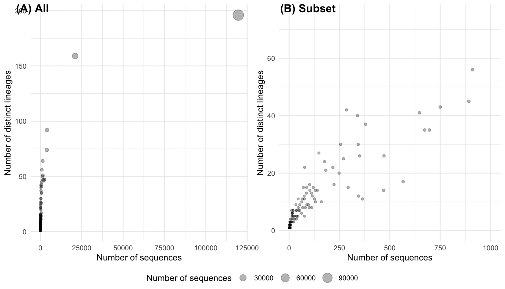

### 4. Lines

Finally, we will work on some lines! Before making the plot, we first need to do a bit more data compilation. We are going to plot the cumulative number of sequences found in the B.1.177 lineage over time. The column sample_date corresponds to the date of the sample collection. We can use the clever R manipulation functions from dplyr to manipulate the data and calculate the cumulative number of sequences for each country and then filter to extract the country and lineage that we are interested in.

``` r
cog_data$cnt<-1

UK_lineage_change<- cog_data %>% 
  group_by(country,lineage) %>% 
  arrange(sample_date) %>% 
  mutate(CumulativeCount = cumsum(cnt)) %>%
  filter(lineage=="B.1.177" & country =="UK")

# and let's format the sample_date column
UK_lineage_change$sample_date<-as.Date(UK_lineage_change$sample_date,format="%Y-%m-%d")
```

Hope you’ve already guessed the function we will be using for the line plot - `geom_line`.

``` r
ggplot() +
  geom_line( data = UK_lineage_change, aes( x = sample_date, y = CumulativeCount ), color = "red" ) 
```

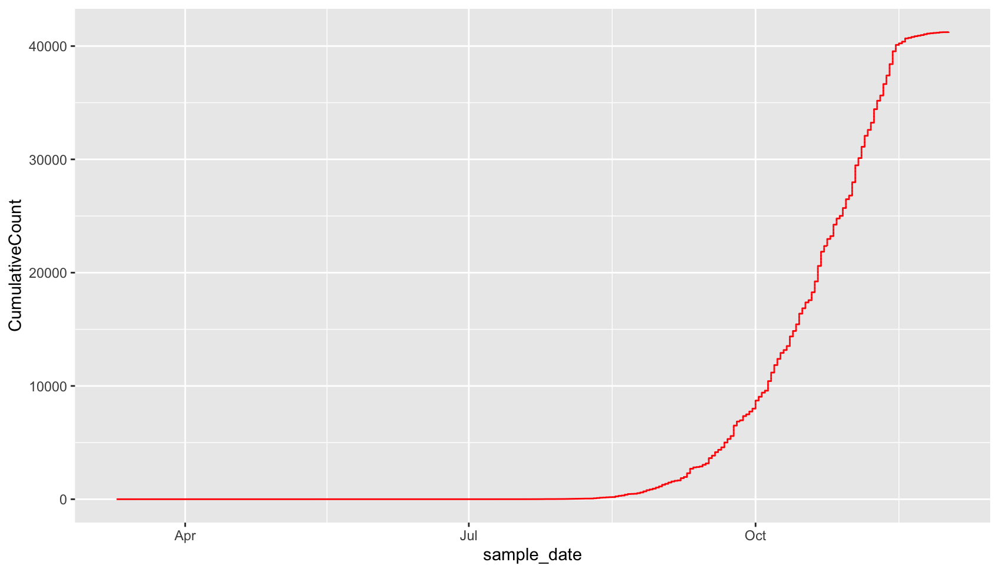

We can repeat the filtering for a further three countries: Denmark, Spain and Switzerland. We can plot each country with a different colour. Note the use of the group=country to force points from the same country to be plotting consecutively.

``` r

lineage_change<- cog_data %>% 
  group_by(country,lineage) %>% 
  arrange(sample_date) %>% 
  mutate(CumulativeCount = cumsum(cnt)) %>%
  filter(lineage=="B.1.177" & country %in% c("Denmark","Spain","Switzerland"))

# and let's format the sample_date column
lineage_change$sample_date<-as.Date(lineage_change$sample_date,format="%Y-%m-%d")

ggplot() +
  geom_line( data = lineage_change, aes( x = sample_date, y = CumulativeCount, group=country, col=country ) ) 

```

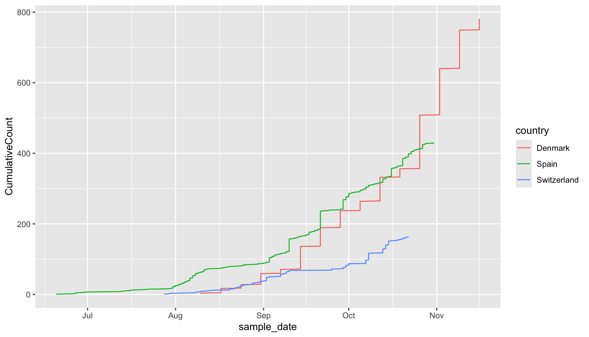

#### 4.1 Axis labeling and titles

The current figure can be further improved in several aspects. We will focus on the text and the titles of the axis, in addition to the legend. We would like to have the x-axis title as "Date" and the y-axis title should be "Cumulative number of sequences". The formatting of the legend can also be changed.

``` r
ggplot() +
  geom_line( data = lineage_change, aes( x = sample_date, y = CumulativeCount, group=country, col=country ) ) + 
  theme_bw() + 
  xlab("Date") + 
  ylab("Cumulative number of sequences") + 
  theme( legend.title = element_blank(), legend.position.inside = c(0.2,0.75) )

```

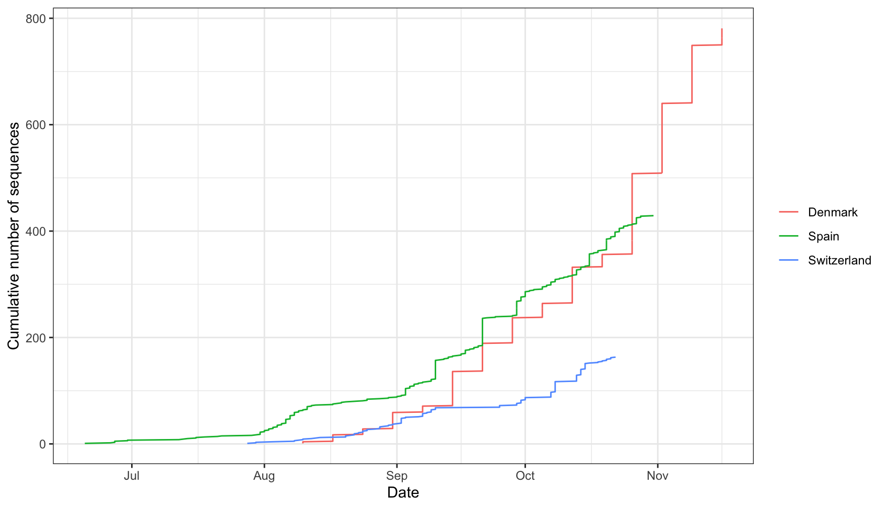

I hope you've managed to pick-up some of the advantages of manipulating data and plotting in R. There is a huge amount to learn but hopefully this will be a starting point.

### 5. Extra exercise

If time allows, use the file in `home4/VBG_data/Rplotting/depth.txt` to plot the coverage. The file was produced using `samtools depth`. The file doesn't have a header but the first column is the name of the reference sequence used, the second column is the position in the reference sequence and the thrid column is the depth.

